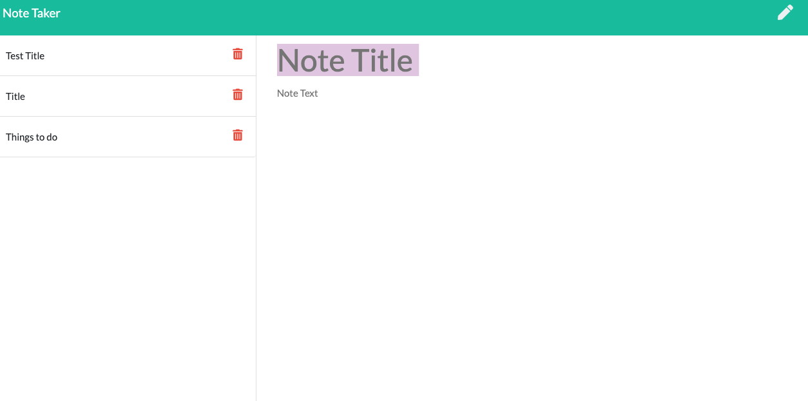

# Note Taker
# Description
For people that need to keep track of a lot of information, it's easy to forget important things. Being able to take persistent notes allows people to have written information available when they need it. 

# Technologies
* Node.js
* JavaScript
* Express.js
* CRUD

# Links
[Repository: https://github.com/layc41/note-taker-11](https://github.com/layc41/note-taker-11)

[Deployed Site: https://ancient-ridge-97223.herokuapp.com/](https://ancient-ridge-97223.herokuapp.com/)

# Screenshot & Video

[Video](https://drive.google.com/file/d/1RNJM1UYQH49BQu0l6i-3yJ63VcaKlv0O/view)

# Tests
N/A.

# Questions
* [GitHub](https://github.com/layc41)
* Email: claudialay41@gmail.com